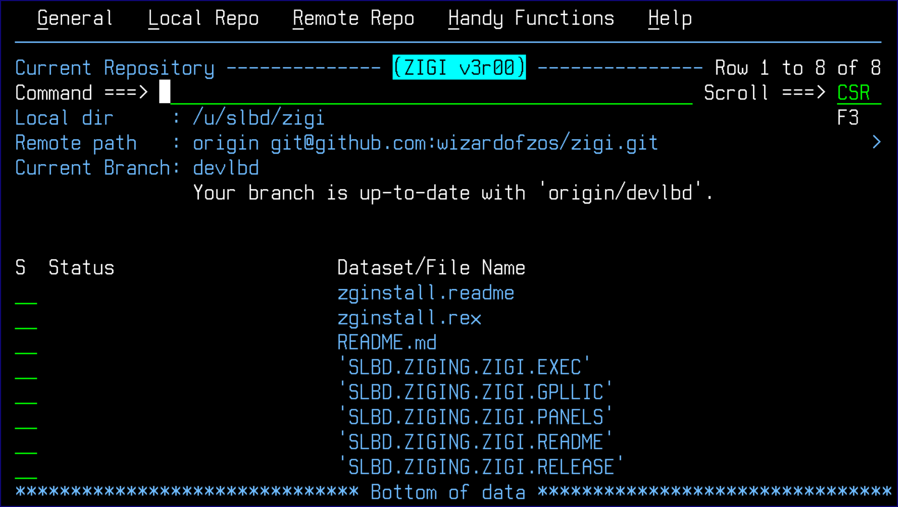

# The ZIGI Current Repository Panel

This topic explains the components of the ZIGI **Current Repository** panel.

When a repository is selected from the Local Repositories panel, the z/OS data sets associated with the repository are displayed:

For demonstration purposes, this user guide uses the ZIGI repository to start with.

This section includes the following topics:

-   [Action Bar Menus](r_action_bar_menus.md)
-   [AddAll Command](r_addall.md)
-   [AddDsn Command](r_adddsn.md)
-   [Branch Command](r_branch.md)
-   [Check Command](r_check.md)
-   [Commit Command](r_commit.md)
-   [Convert Repository \(CONVREPO\) Command](r_convert_repository_convrepo.md)
-   [Extract Command](r_extract.md)
-   [Flow Command](r_flow.md)
-   [GitCmd Command](r_gitcmd.md)
-   [Git Help](r_git_help.md)
-   [GitLog Command](r_gitlog.md)
-   [Grep Command](r_grep.md)
-   [Network](r_network.md)
-   [Options Menu Assist](r_options_menu_assist.md)
-   [Pull](r_pull.md)
-   [Push](r_push.md)
-   [Replace](r_replace.md)
-   [Remote Command](r_remote.md)
-   [Set Command](r_set.md)
-   [Snapshot](r_snapshot.md)
-   [Stash](r_stash.md)
-   [Stash List \(STASHL\) Command](r_stash_list.md)
-   [Status Command](r_status_crp.md)
-   [Tag](r_tag.md)
-   [TagList](r_taglist.md)
-   [View](r_view_CRP.md)
-   [Row Selections](r_row_selections.md)

-   **[Action Bar Menus](r_action_bar_menus.md)**  

-   **[AddAll Command](r_addall.md)**  
This topic explains the functionality of the AddAll command.
-   **[AddDsn Command](r_adddsn.md)**  
This topic explains the functionality of the AddDsn command.
-   **[Branch Command](r_branch.md)**  
This topic explains the functionality of the Branch command.
-   **[Check Command](r_check.md)**  
This topic explains the functionality of the Check command.
-   **[Commit Command](r_commit.md)**  
This topic explains the functionality of the Commit command.
-   **[Convert Repository \(CONVREPO\) Command](r_convert_repository_convrepo.md)**  
This topic explains the functionality of the CONVREPO command.
-   **[Extract Command](r_extract.md)**  
This topic explains the functionality of the Extract command.
-   **[Flow Command](r_flow.md)**  
This topic explains the functionality of the Flow command.
-   **[GitCmd Command](r_gitcmd.md)**  
This topic explains the functionality of the GitCmd command.
-   **[Git Help](r_git_help.md)**  

-   **[GitLog Command](r_gitlog.md)**  
This topic explains the functionality of the GitLog command.
-   **[Grep Command](r_grep.md)**  
This topic explains the functionality of the Grep command.
-   **[Network](r_network.md)**  
This topic explains the functionality of the Network command.
-   **[Options Menu Assist](r_options_menu_assist.md)**  
This topic explains the functionality of the **ZIGI Current Repository Commands** pop-up.
-   **[Pull](r_pull.md)**  

-   **[Push](r_push.md)**  

-   **[Replace](r_replace.md)**  

-   **[Remote Command](r_remote.md)**  

-   **[Set Command](r_set.md)**  
This topic explains the functionality of the Set command.
-   **[Snapshot](r_snapshot.md)**  

-   **[Stash](r_stash.md)**  

-   **[Stash List \(STASHL\) Command](r_stash_list.md)**  
This topic explains the functionality of the Stash List \(STASHL\) command.
-   **[Status Command](r_status_crp.md)**  

-   **[Tag](r_tag.md)**  

-   **[TagList](r_taglist.md)**  
This topic explains the functionality of the TagList command.
-   **[View](r_view_CRP.md)**  

-   **[Row Selections](r_row_selections.md)**  

