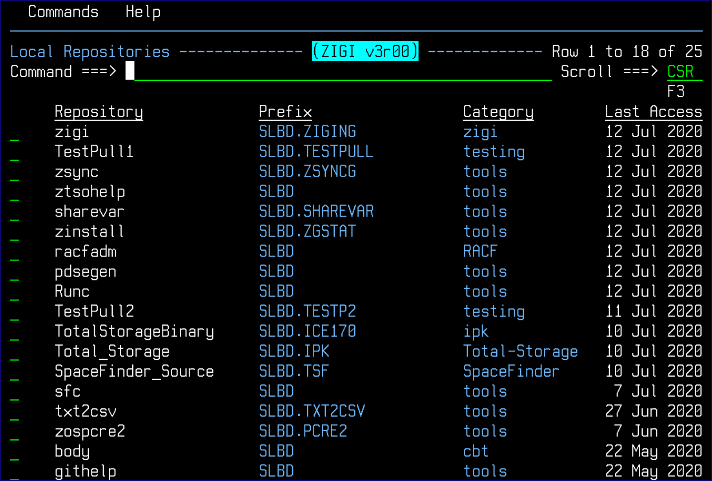

# The ZIGI Local Repositories Panel

This topic explains the components of the ZIGI **Local Repositories** panel.

After the preparatory work above, the main **Local Repositories** panel displays, which lists all of the local Git repositories that have been added to ZIGI:

There are both commands and row selections available for use. The commands are available via the Action Bar menu and the row selections are available by entering a / in the row selection. This means you can move the cursor to them and press Enter or move the cursor there using your mouse and double-click with the left mouse button \(this assumes your TN3270 emulator supports that feature; most do but you may have to enable it\).

This chapter includes the following topics:

-   [Action Menu Bar](r_action_menu_bar_LRP.md)
-   [Clone](r_clone_lrp.md)
-   [Config](r_config_lrp.md)
-   [Connect](r_connect.md)
-   [Create](r_create_lrp.md)
-   [GITHELP](r_githelp_lrp.md)
-   [Options Menu Assist](r_options_menu_assist_lrp.md)
-   [Select Command](r_select_command_lrp.md)
-   [Sort Selections Pop-Up Menu](r_sort_lrp.md)
-   [SSH Public Key](r_ssh_lrp.md)
-   [Row Selections](r_rr_row_selections_LRP.md)

-   **[Action Menu Bar](r_action_menu_bar_LRP.md)**  
This topic explains the Commands and Help menus.
-   **[Clone](r_clone_lrp.md)**  
This topic explains the clone repository functionality.
-   **[Config](r_config_lrp.md)**  
This topic explans the Config command.
-   **[Connect](r_connect.md)**  
This topic explains the Connect command.
-   **[Create](r_create_lrp.md)**  
This topic explains the Create command.
-   **[GITHELP](r_githelp_lrp.md)**  
This topic explains the GITHELP ISPF dialog.
-   **[Options Menu Assist](r_options_menu_assist_lrp.md)**  
This topic explains the options menu assist pop-up menu.
-   **[Select Command](r_select_command_lrp.md)**  
This topic explains the Select command.
-   **[Sort Selections Pop-Up Menu](r_sort_lrp.md)**  
This topic explains the **zigi Sort Selections** pop-up menu.
-   **[SSH Public Key](r_ssh_lrp.md)**  
This topic explains how to display your SSH public key.
-   **[Row Selections](r_rr_row_selections_LRP.md)**  

