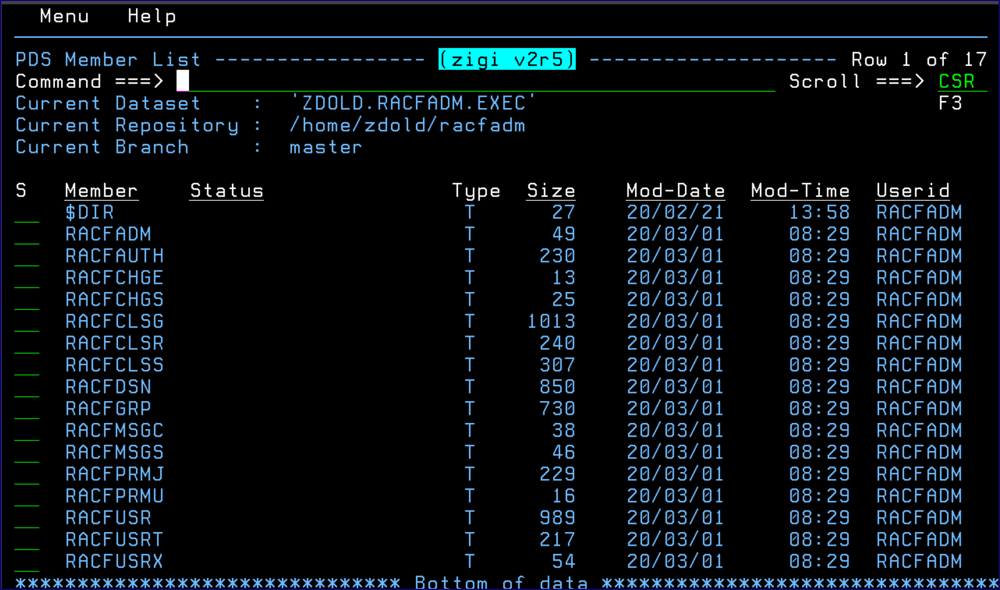

# The ZIGI PDS Member List

From the Repository display, if the selected data set is a PDS, then the **PDS Member List** displays:

**Note:** The **Type** column contains a **T** if the member is a text member and a **B** if it is binary.

This chapter includes the following topics:

-   [Action Bar Menu](r_action_bar_menu.md)
-   [Locate Command](r_locate_command.md)
-   [Commit](r_commit_command.md)
-   [GitLog](r_gitlog_command.md)
-   [Grep](r_grep_command.md)
-   [Sort Command](r_sort_command.md)
-   [Status](r_status_command.md)
-   [Reset-IDs Command](r_reset_ids_command.md)
-   [Options \(O\) Command](r_options_o_command.md)
-   [Member Select Option](r_member_select_option.md)
    -   [Add Option](r_add_option.md)
    -   [AddBin Option](r_addbin_option.md)
    -   [Browse Options](r_browse_options.md)
    -   [Diff Option](r_diff_option.md)
    -   [History Option](r_history_option.md)
        -   [Commit View](r_commit_view.md)
        -   [Source View](r_source_view.md)
        -   [Recovery](r_recovery.md)
-   [Remove and Rename](r_remove_and_rename.md)
-   [Undo](r_undo.md)
-   [View](r_view.md)
-   [/ Row Selection Prompt](r_row_selection_prompt.md)

-   **[Action Bar Menu](r_action_bar_menu.md)**  
This topic provides a screenshot of the action bar menu.
-   **[Locate Command](r_locate_command.md)**  

-   **[Commit](r_commit_command.md)**  

-   **[GitLog](r_gitlog_command.md)**  

-   **[Grep](r_grep_command.md)**  

-   **[Sort Command](r_sort_command.md)**  

-   **[Status](r_status_command.md)**  

-   **[Reset-IDs Command](r_reset_ids_command.md)**  

-   **[Options \(O\) Command](r_options_o_command.md)**  

-   **[Member Select Option](r_member_select_option.md)**  

