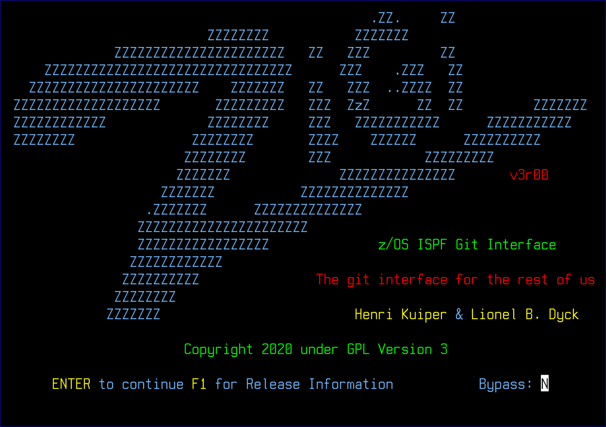

# About ZIGI

Git is becoming pervasive for source code management \(SCM\) and the z/OS developer has been left out until now.

The z/OS ISPF Git Interface \(AKA ZIGI\) provides the z/OS developer with a very useable Git client.

ZIGI is open-source and can be found at [https://ZIGI.rocks](https://ZIGI.rocks).

**Author**: Henri Kuiper \(henri@zdevops.com\): [zdevops.com](http://zdevops.com)

**Author**: Lionel B. Dyck \(lbdyck@gmail.com\)

