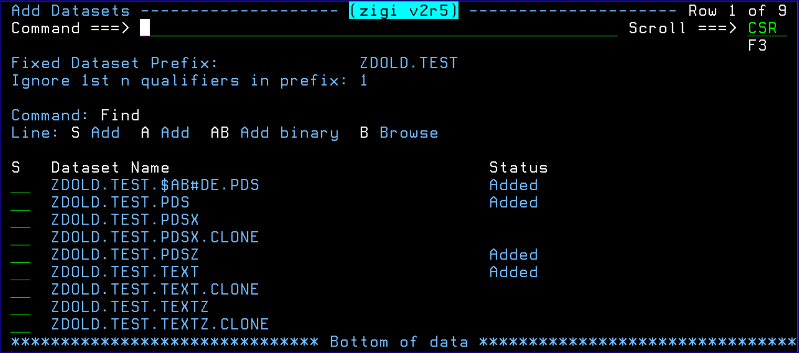
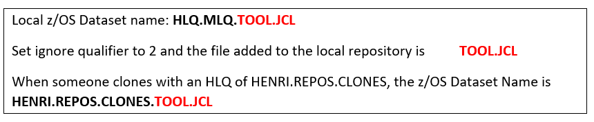
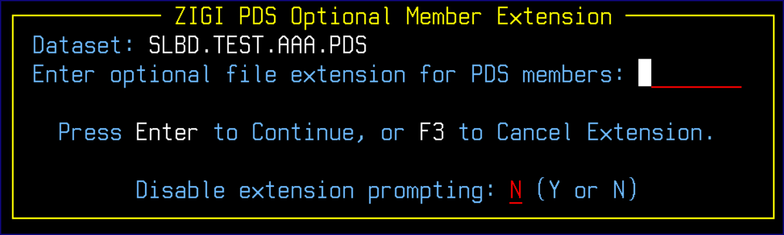

# AddDsn Command

This topic explains the functionality of the AddDsn command.

The AddDsn command makes it easy to add additional z/OS data sets to the local repository.

In the figure above, four data sets were already added to the local repository and others are available to add.

If the repository is new and there are no z/OS data sets included, then the **Fixed Dataset Prefix** and **Ignore 1st n qualifiers in prefix** are blank and must be filled in before the list of z/OS data sets may be presented. The qualifiers to ignore should be at least 1 but may be 0.

The **Fixed Dataset Prefix** field is the HLQ for the data sets to be presented, from which one, or more, may be added to the repository. Be aware that adding a binary data set using the A or S option adds the data set as text data and not binary. If the data set contains binary data, then add it using the AB \(add binary\) option.

If the data set is a load library \(RECFM=U\), then it is added as binary and as an executable load module regardless of the selection \(S, A, AB\). If there are aliases associated with any load module then those are retained as well in the copy operation from z/OS to OMVS and restored in the OMVS to z/OS copy.

The **Ignore 1st n qualifiers in the prefix** field instructs ZIGI to ignore those qualifiers when creating the OMVS file, or directory, for the data set. Thus GITUSER.ZIGI.ZIGI.README is created in the OMVS filesystem as ZIGI.README. Then when someone else clones this repository, the file is uploaded using the HLQ that they provide, which results in a z/OS data set of hlq.ZIGI.README. Make sure that the ignore count does not exceed the number of qualifiers of the data set you want to add.

To clarify:

When adding a PDS, you are prompted to enter an optional file extension to be used when copying the PDS members to the OMVS filesystem. This enables the use of workstation clients to clone and update a repository by using the file extensions to easily identify the language type within the workstation editors \(for example: source.c instead of SOURCE\). If the optional extension is not provided, then the member names continue to be copied in uppercase to the OMVS filesystem without any file extensions.

There is a restriction that only one file extension is allowed per PDS. This restriction is in place to prevent member name collisions from two files with the same file name but different file extensions \(for example: source.c and source.jcl\). This prompt may be disabled for the current set of adds by entering a Y to disable.

**Note:** The **ZIGI PDS Optional Member Extension** prompt may be bypassed by setting the bypass option to Y \(yes\) on the config settings panel from the **Local Repository** panel.

*NEXT TOPIC*: [Select \(S\) and Add \(A\) Commands](r_select_s_and_add_a.md)

-   **[Select \(S\) and Add \(A\) Commands](r_select_s_and_add_a.md)**  
This topic explains the Select and Add commands.
-   **[Add Binary \(AB\) Function](r_add_binary_ab.md)**  
This topic explains the Add Binary \(AB\) function.
-   **[Browse \(B\)](r_browse_b.md)**  

**Parent topic:**[The ZIGI Current Repository Panel](c_the_zigi_current_repository_panel.md)

