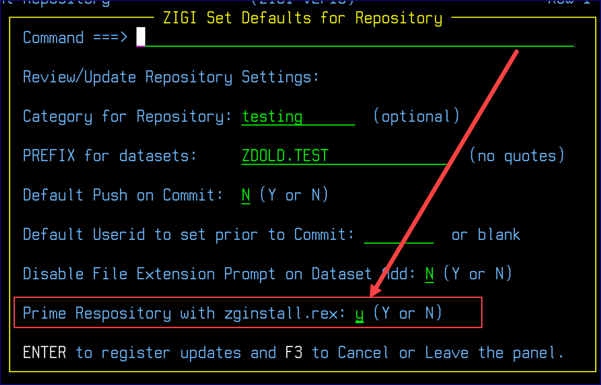
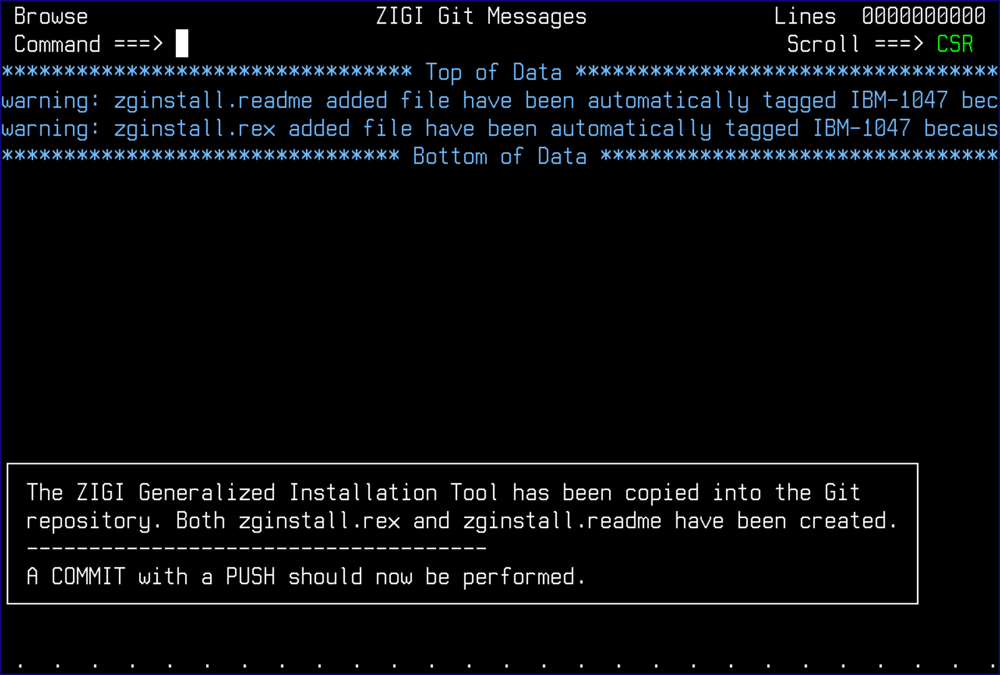

# Appendix B: Using ZGINSTALL.REX

The zginstall.rex is a generic installation tool that works with any ZIGI-managed repository to recreate the z/OS data sets when a repository is cloned outside of ZIGI. It is intended for use when a site does not have ZIGI installed on z/OS to allow ZIGI-managed repositories to be installed easily.

To add zginstall.rex to a repository, use the SET command in the Current Repository and update the settings:

This generates a short and long message on the **ZIGI Git Messages** screen:

A git add is performed automatically. Perform a Commit and Push to lock in this update.

*NEXT TOPIC:* [Appendix C: Learning Resources](r_appendix_c_learning_resources.md)

