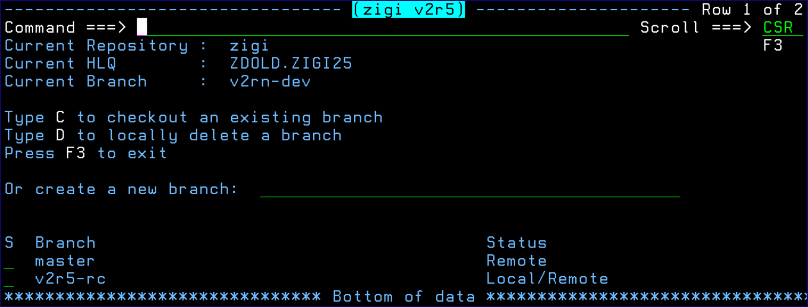

# Branch Command

This topic explains the functionality of the Branch command.

The Branch command allows you to change to a different repository. If the branch does not exist, you may create it \(effectively performing a checkout -b\). If it exists, you may check out that branch with the C line command.

**Note:** The **Status** column indicates if the branch is only on the **Remote** server, or if there is a local copy \(**Local/Remote**\).

*NEXT TOPIC*: [Check Command](r_check.md)

**Parent topic:**[The ZIGI Current Repository Panel](c_the_zigi_current_repository_panel.md)

