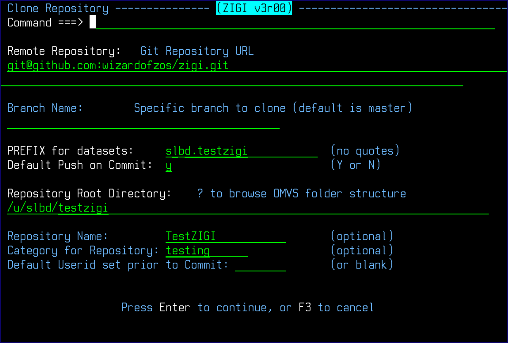
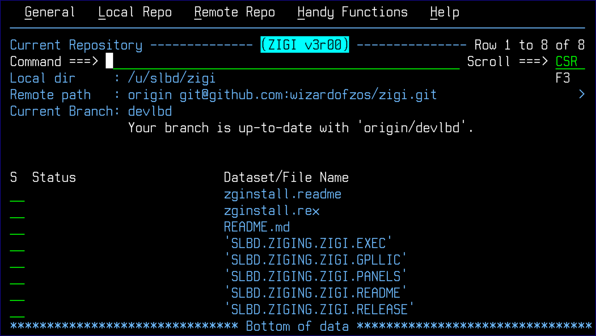

# Clone

This topic explains the clone repository functionality.

Clone makes a copy of a repository that resides on a remote server on your local OMVS filesystem and into a set of z/OS data sets based on a HLQ that you provide.

In the above example, the **Remote Repository** is the ZIGI repository on GitHub.

The authors have selected to enter the local OMVS directory manually, and the HLQ \(prefix\) for the z/OS data sets is specified.

If a ? is entered into the **Local dir** field, then a dialog is displayed to walk down the OMVS directories to find or make \(MKDIR\) the directory where the cloned repository is placed.

All fields except **Branch Name**, **Repository Name**, and **Category for Repository** are required fields.

The **Repository Name** defaults, if blank, to the Git name of the repository, otherwise the name is used for the local OMVS directory name for the clone operation.

The **Category for Repository** is helpful as a sort option on the Local Repository table display.

The **Default Push on Commit** option, if set to Y, is the default on the Commit panel to push after each commit.

The **Default Userid set prior to Commit** is set if there is a requirement to change the ISPF statistics userid for each PDS member before a commit. After the cloning is complete, the z/OS data sets in the repository are displayed.

This is also the panel that is displayed when the repository is selected from the primary panel.

If any existing z/OS data sets are about to be replaced by the clone operation, a display is presented during the clone process asking for permission with an option to change the data set prefix for the cloned data sets.

**Note:** ZIGI creates PDSE Version 2 libraries for all partitioned data sets with a default MAXGEN of 0 \(see the [Config](r_config_lrp.md) command to change the default number of generation\).

*NEXT TOPIC*: [Config](r_config_lrp.md)

**Parent topic:**[The ZIGI Local Repositories Panel](c_the_zigi_local_repositories_panel.md)

