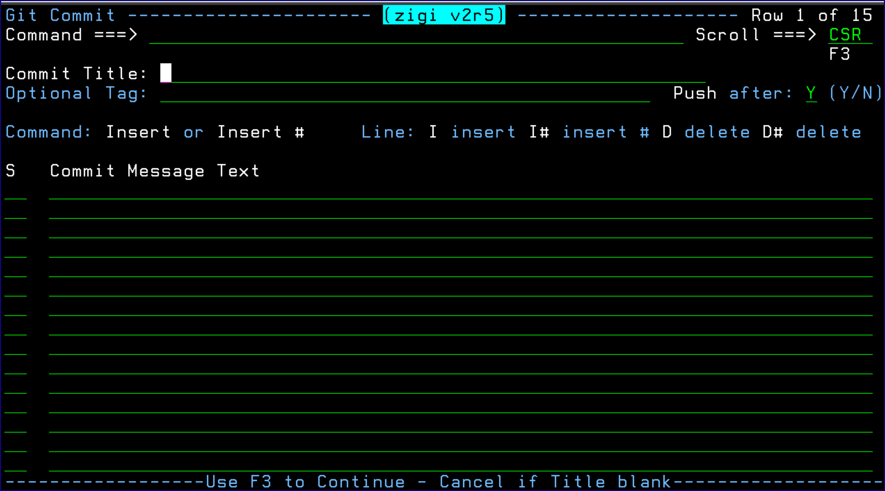

# Commit Command

This topic explains the functionality of the Commit command.

The Commit command commits the current set of changes that have been added to the Git index to the local repository. This does not push the updates to the remote repository unless the **Push after** field is set to Y.

1.  Enter a title, which is limited to 50 characters, that summarizes the changes being committed.
2.  Enter as many lines of text as required. Initially 15 lines are available for text entry; however, more can be inserted using the Insert command \(for example: I 10\) or the line command I \(for example: I 9\).
3.  A line may be deleted using the delete \(D\) line command.
4.  Optionally, entering a Tag generates a git tag command to tag the repository.

*NEXT TOPIC*: [Convert Repository \(CONVREPO\) Command](r_convert_repository_convrepo.md)

**Parent topic:**[The ZIGI Current Repository Panel](c_the_zigi_current_repository_panel.md)

