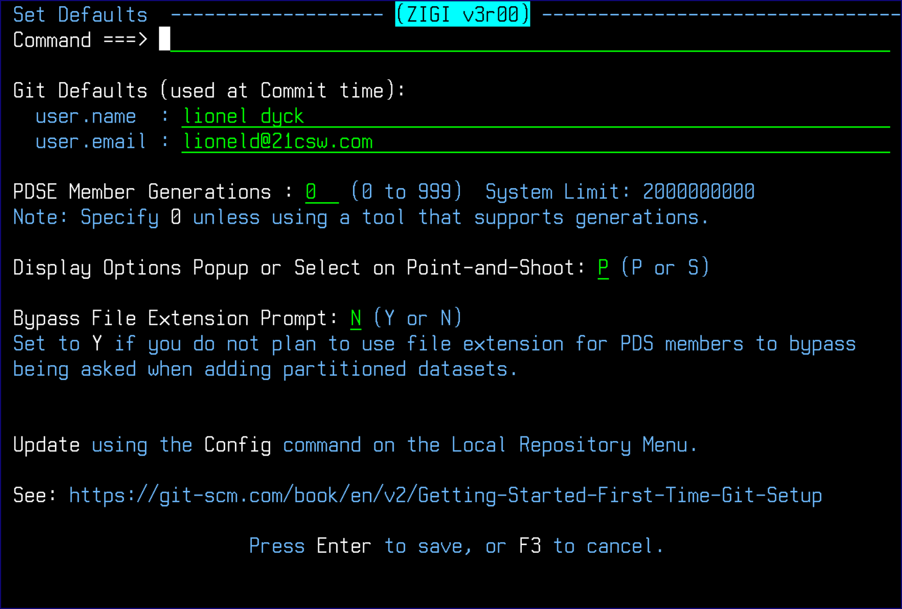

# Config

This topic explans the Config command.

This command allows you to view and update, if desired, your username and e-mail, the PDSE member generations default, and the display options pop-up.

Another option that is configured here is the option to bypass being asked if a file extension should be used for all members of the added PDS when the members are copied to the repository's OMVS filesystem.

In the future, this is also where other, user-customizable options can be configured. At this point, the **PDSE Member Generations** field should be 0 unless there is a tool available that can work with Member Generations \(see PDSEGEN for an open-source solution\).

*NEXT TOPIC*: [Connect](r_connect.md)

**Parent topic:**[The ZIGI Local Repositories Panel](c_the_zigi_local_repositories_panel.md)

