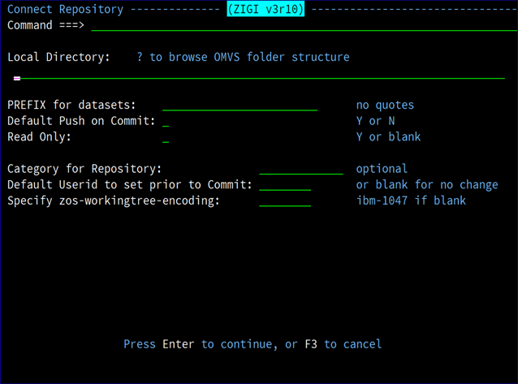

# Connect

This topic explains the Connect command.

The Connect command adds an existing local ZIGI-formatted Git repository to the ZIGI ISPF Table for ZIGI management.

The local repository should point to the existing OMVS filesystem directory where the Git repository exists, and the repository must conform to ZIGI standards \(with a .zigi subdirectory\).

The other options are identical to the Clone and Create panels.

**Note:** The repository name is dynamically determined by the name of the repository directory.

*NEXT TOPIC*: [Create](r_create_lrp.md)

**Parent topic:**[The ZIGI Local Repositories Panel](c_the_zigi_local_repositories_panel.md)

