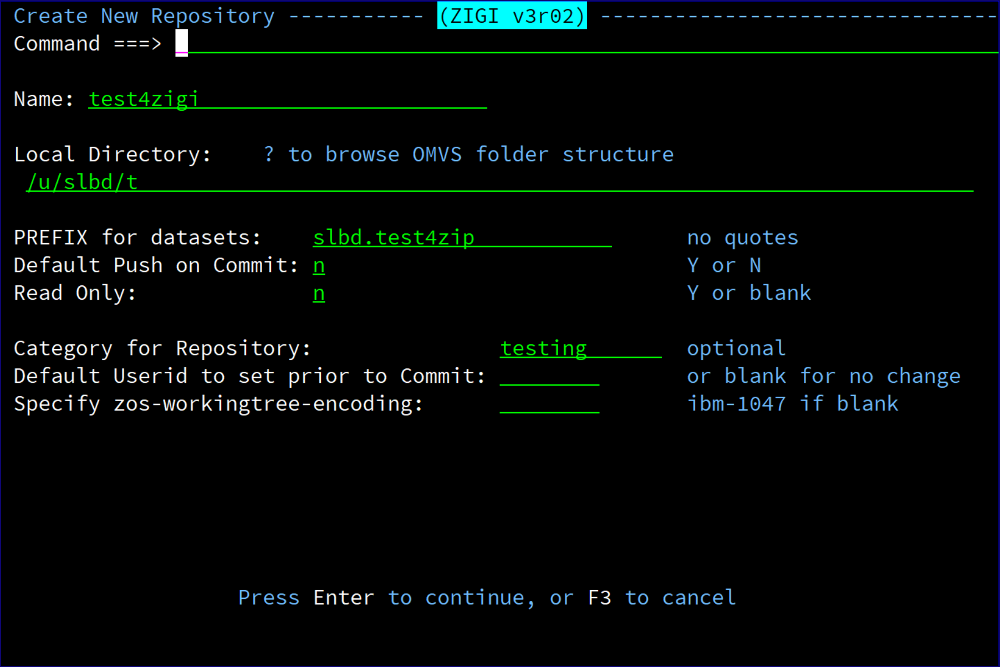
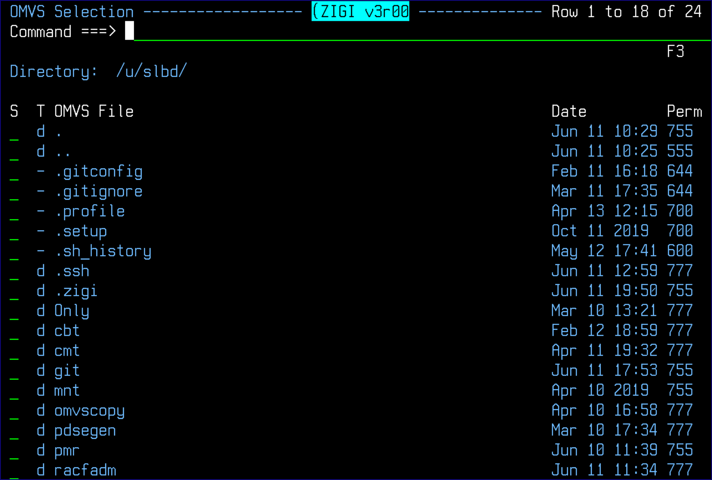
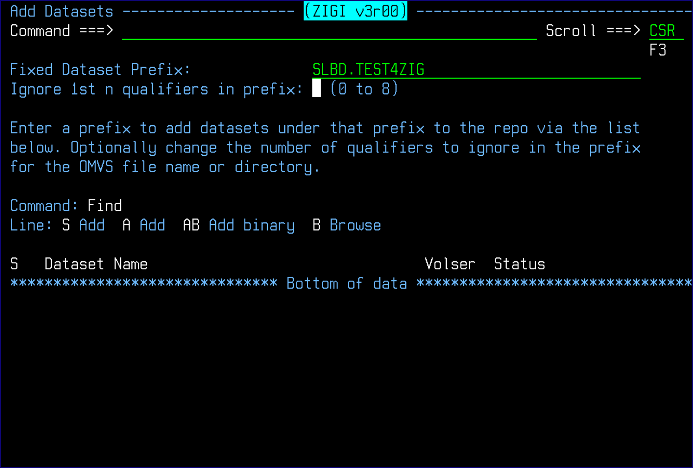

# Create

This topic explains the Create command.

The Create command creates a new local repository that can be added to a remote repository.

In the above example, a test repository is created in your test directory.

Using a ? in the **Local Directory** field brings up a file directory list from which a directory may be selected or created \(MKDIR\) and then selected.

The default push on commit option, if set to Y, is the default on the Commit panel to push after each commit. A read only repository is one in which the z/OS data sets are never updated by ZIGI and are intended to track changes to z/OS data sets. All changes are tracked by ZIGI and Git. All ZIGI features that could update or delete z/OS data sets are blocked. These repositories can be pushed to a Git server and then cloned; however, clone requires a data set prefix that should prevent a clone from replacing any existing z/OS data sets.

The **Category for Repository** is used for the ZIGI Local Repositories display to categorize the local repositories for sorting and easier identification.

The **Default Userid to set prior to Commit** is set if there is a requirement to change the ISPF statistics userid for each PDS member before a commit.

The encoding is the character set to be used for all data added to the repository. The default is ibm-1047.

The Read Only option creates a read-only repository. This repository is configured such that ZIGI does not allow any updates to the z/OS data sets from within ZIGI. This may be used for a shared local repository where several users access it for reference while preventing updates.

The repository may still be updated if the z/OS data sets are updated outside of ZIGI which causes ZIGI to update the OMVS files and thus the Git repository.

Edit, Merge, Branch, Replace, and any other ZIGI action that could update the z/OS data sets is prevented, but working outside of ZIGI does not prevent the updates from occuring.

After the Create process completes, the **Add Datasets** panel displays to facilitate populating the repository with z/OS data sets: 

This can also be achieved using the ADDDSN command to add existing z/OS data sets to the repository. See the [AddDsn Command](r_adddsn.md) command, which is not to be confused with the add row selection, for more information.

*NEXT TOPIC*: [GITHELP](r_githelp_lrp.md)

**Parent topic:**[The ZIGI Local Repositories Panel](c_the_zigi_local_repositories_panel.md)

