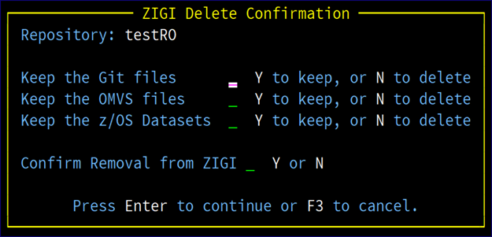

# Delete Option

The Delete option removes the repository from ZIGI management by removing it from the ZIGI local repository ISPF Table. Options are provided to keep, or delete, the Git files, OMVS files, and z/OS data sets.

Confirmation on the **ZIGI Delete Confirmation** screen is required to proceed as a failsafe.

*NEXT TOPIC*: [/ Row Selection Prompt](r_row_selection_prompt_lrp.md)

**Parent topic:**[Row Selections](r_rr_row_selections_LRP.md)

