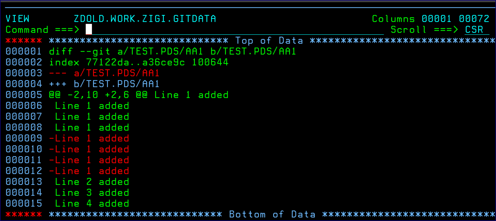

# Diff Option

Diff option compares the active file in the OMVS filesystem with the last index for the file.

The diff is displayed using ISPF View that has been enhanced to highlight the additions and deletions in the file. If there have been no changes since the last commit, then there is nothing to compare.

*NEXT TOPIC:* [History Option](r_history_option.md)

**Parent topic:**[Member Select Option](r_member_select_option.md)

