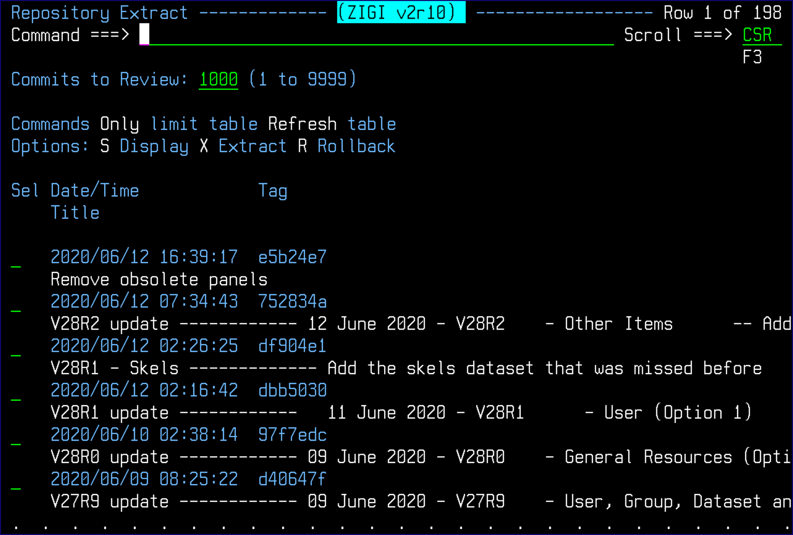
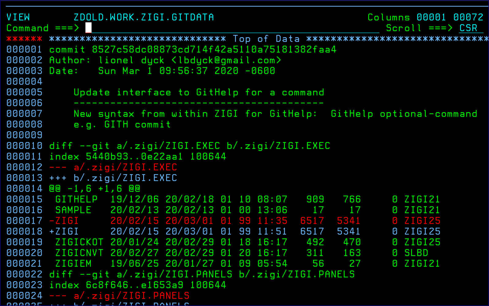
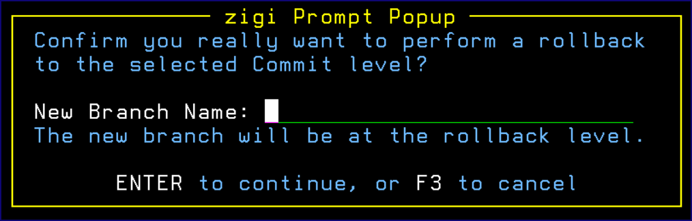
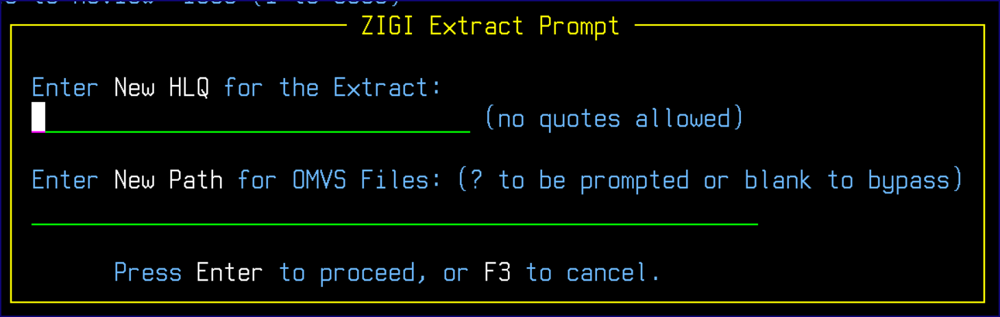

# Extract Command

This topic explains the functionality of the Extract command.

The **Repository Extract** screen provides you with several options working within the current repository.

The extract selection display is:

Use ONLY \(O\) followed by a short string to limit the display of items to those that match the string in the commit title.

Use REFRESH \(R\) to restore the full display.

Select the individual commit to view it:

Or select using R to Rollback to that commit level:

The **zigi Prompt Popup** requires the name of a new branch and that the word ROLLBACK be entered in uppercase letters to confirm that you want to do it.

Option X is used to extract all the changed elements from all the selected commits into a set of non-Git managed data sets and OMVS directory. This can be used for packaging to distribute changes to others \(for example: create a PTF\). When multiple commits are selected, all changed elements from all selected commits is collected, then the most recent commit level is checked out to a temporary branch from which the changed elements are copied from.

The **ZIGI Extract Prompt** displays:

Enter an HLQ for the extracted z/OS data sets and an optional OMVS directory \(must not currently exist as it is created\) into which the changed elements are copied.

*NEXT TOPIC*: [Flow Command](r_flow.md)

**Parent topic:**[The ZIGI Current Repository Panel](c_the_zigi_current_repository_panel.md)

