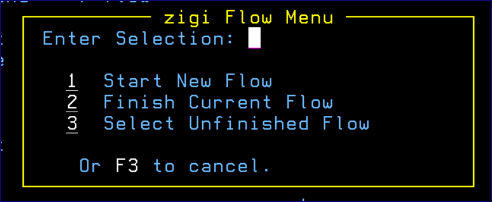
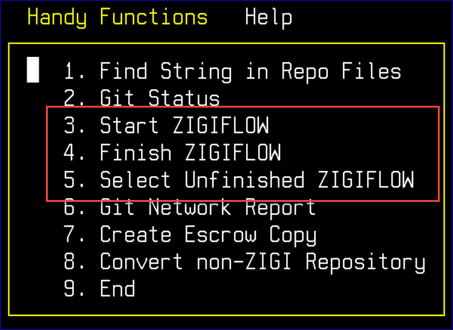
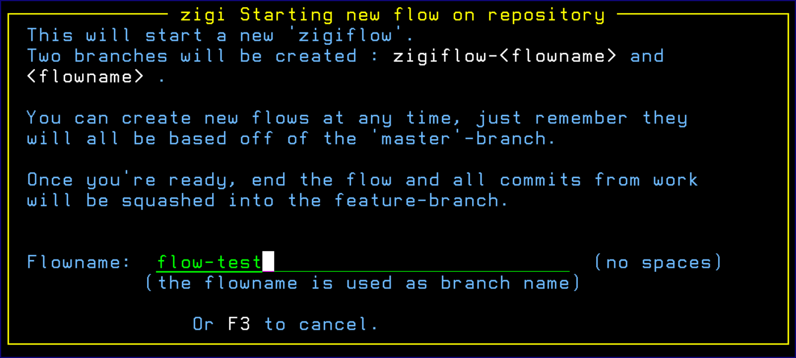
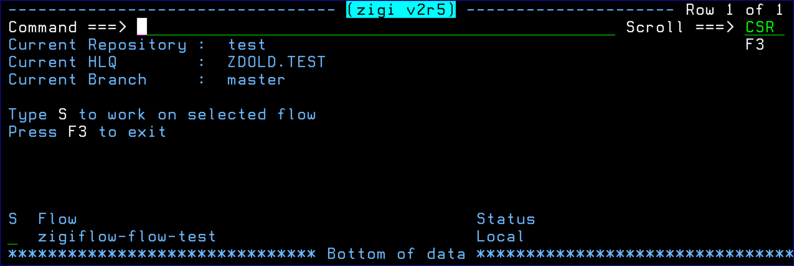

# Flow Command

This topic explains the functionality of the Flow command.

To assist you in your workflow, ZIGI helps you via the ZIGI flow commands. The FLOW command displays the **zigi Flow Menu**:

The **Handy Functions** action bar menu is similar:

A new ZIGI flow can be started at any time if the workspace is clean. In other words, there can be no local changes that are not committed to the current branch.

When starting a new ZIGI flow, ZIGI prompts you for a flow name. This is used internally as a branch name so spaces are not allowed.

Upon starting a flow, ZIGI checks out the master branch, create a new branch called zigiflow-yourFlowName, and also creates a yourFlowName branch. Both of these branches are identical to master.

Then you can make changes, commit, and once done, finish the flow. Upon finishing the flow, all the commits from the zigiflow branch are squashed into the final branch at which point this can be merged into the master or pushed out to a remote repository so a pull request might be issued.

Due to the way zigiflow manages the internal branching, it’s easy for you to \(once the workspace for their current work is clean,for example: work-in-progress is committed to the flowbranch\) start another zigiflow \(always based on master\) to perform some efixing. Once that flow is done, the resulting branch can be merged to master \(or pushed for a pull request\) and also be merged into the other workflow.

Switching between workflows is done via option 3 and can only be done in a clean workspace.

*NEXT TOPIC*: [GitCmd Command](r_gitcmd.md)

**Parent topic:**[The ZIGI Current Repository Panel](c_the_zigi_current_repository_panel.md)

