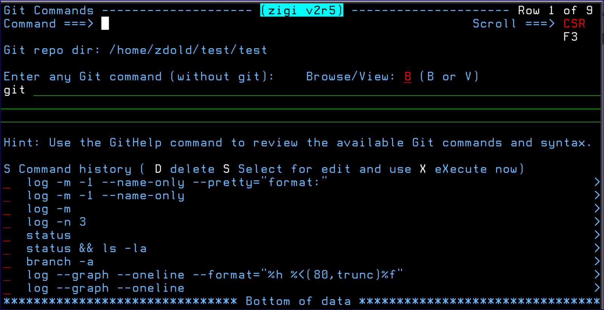
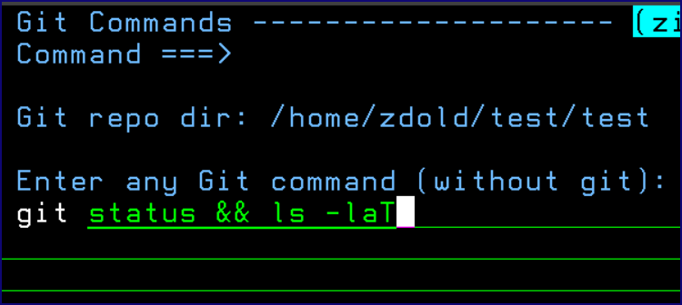

# GitCmd Command

This topic explains the functionality of the GitCmd command.

Git Command is an ISPF dialog, similar to ISPF Option 6, which makes it easy to enter Git commands from within ZIGI, assuming there is something you want to do that ZIGI doesn’t already do.

The dialog displays better in a wide screen; however, if using a standard 80 column display then the command history fields are scrollable \(as indicated by the **\>** symbol on the right side of the screen\).

Any Git command may be entered and it is remembered the first time it is used. The history is a push-down stack of previous commands from which you can delete a command you no longer want to keep, select a command to be placed into the command entry field where it can be tailored and executed, or execute a command and have it placed into the command entry field after execution.

The results of all commands are displayed using ISPF Browse or View, depending upon the selection.

**Note:** Git is already in the command, so you do not have to enter it in the command entry field.

The CLEAR command is available to clear out the table or individual commands in the table may be removed using the D selection option.

The Git command table is shared among all repositories.

To execute multiple commands, including OMVS commands, string them together using &&. See the following figure for an example:

*NEXT TOPIC*: [Git Help](r_git_help.md)

**Parent topic:**[The ZIGI Current Repository Panel](c_the_zigi_current_repository_panel.md)

