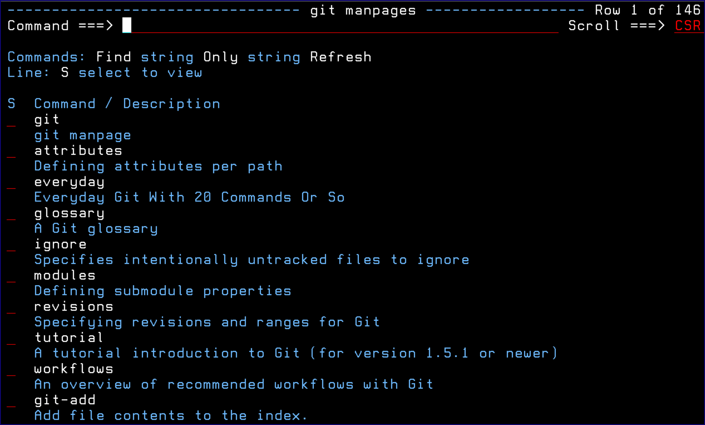
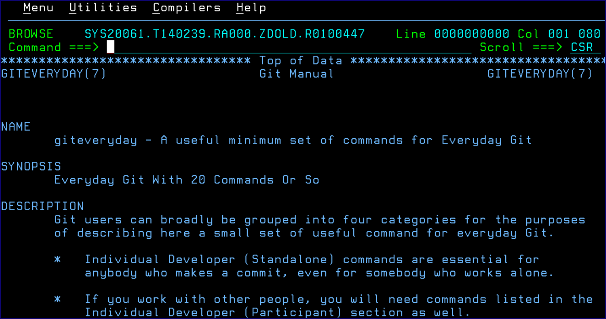

# GITHELP

This topic explains the GITHELP ISPF dialog.

GITHELP is an ISPF dialog that provides simplified access to the Git help documentation. If you have a screen wider than 80 columns, then an alternate display is used where there is one row per command.

Syntax: GITHelp optional command \(e.g. gith commit\)

The Only command, entered with a string, limits the display of available commands to those that match the string in either the command name or the description.

Selecting a command displays the command's manpage:

*NEXT TOPIC*: [Options Menu Assist](r_options_menu_assist_lrp.md)

**Parent topic:**[The ZIGI Local Repositories Panel](c_the_zigi_local_repositories_panel.md)

