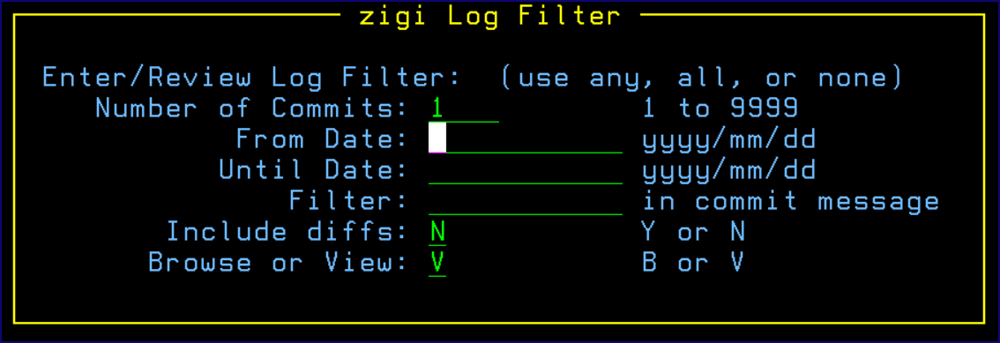
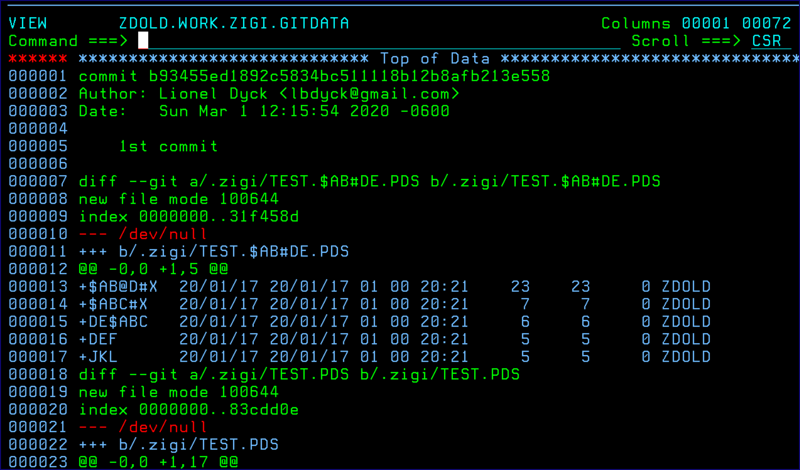

# GitLog Command

This topic explains the functionality of the GitLog command.

This command displays the Git log information. When requested, the **zigi Log Filter** pop-up is presented to request the amount of log information to report:

**Note:** The date format is yyyy/mm/dd, which is translated to yyyy-mm-dd and is required by Git. The reason for this is that we are using the ISPF Panel verify for standard dates to verify the date.

The Filter is a string that is used by grep to filter commits to that string. No blanks allowed. The values entered are remembered in your ISPF Profile for repeated use. The Git log command is executed using the --cc and -m options along with the appropriate options for the above values, after which the ISPF view \(or browse – no special colors with browse\) is invoked on the results:

*NEXT TOPIC*: [Grep Command](r_grep.md)

**Parent topic:**[The ZIGI Current Repository Panel](c_the_zigi_current_repository_panel.md)

