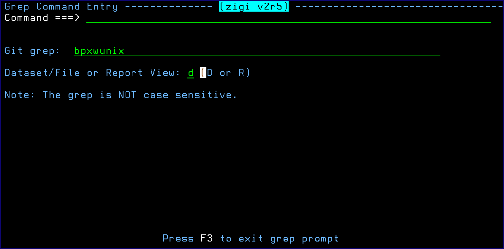
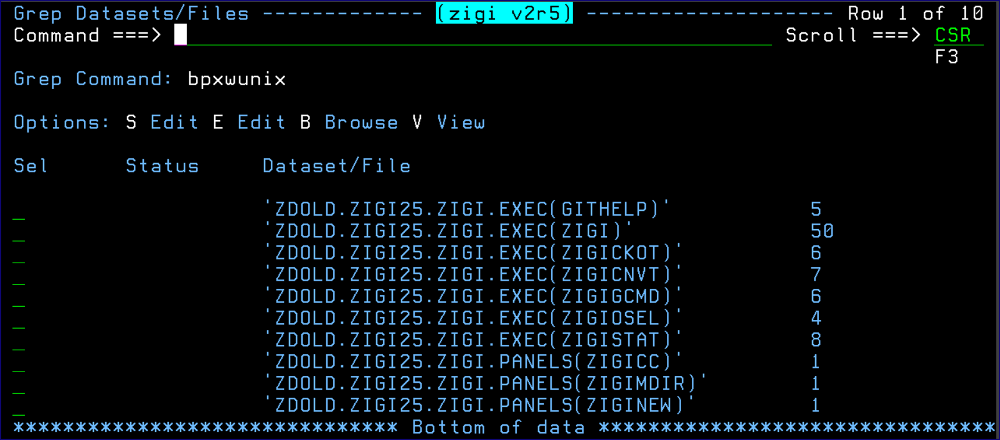
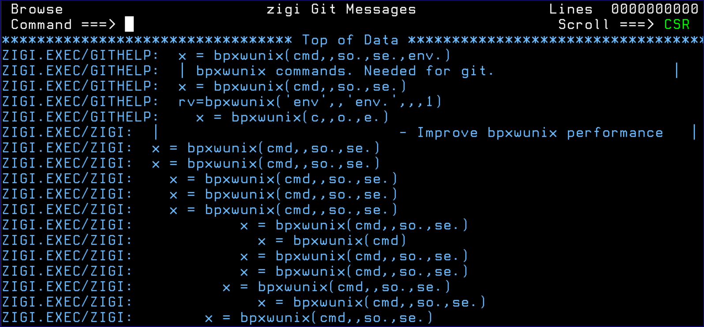
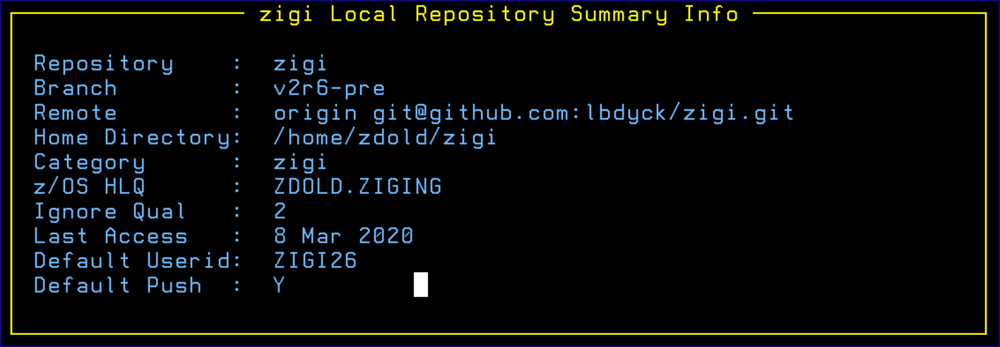

# Grep Command

This topic explains the functionality of the Grep command.

The **Grep Command Entry** screen prompts for a string and then searches the local repository for that string.

The results display on the **Grep Datasets/Files** view:

This view presents each of the data sets, or data set\(member\), where a hit was detected along with reporting how many hits were found in each. You have the ability to Browse, Edit, or View each.

The following image shows the results for the Report view:

The **zigi Local Repository Summary Info** screen displays a short summary of information about the repository.

*NEXT TOPIC*: [Network](r_network.md)

**Parent topic:**[The ZIGI Current Repository Panel](c_the_zigi_current_repository_panel.md)

