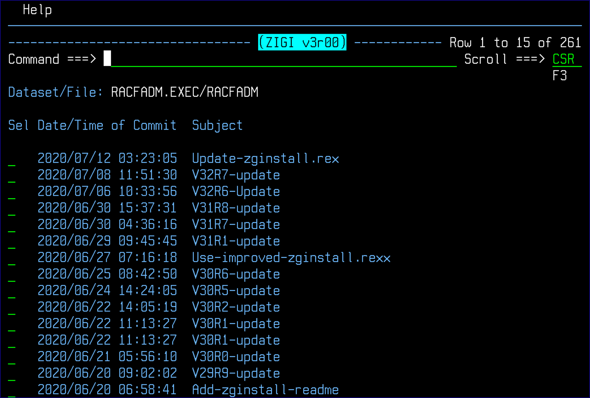
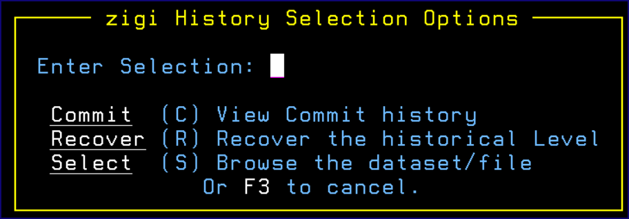

# History Option

History shows a selectable list of all commits for the selected member. From this list, the full source from that point in time may be viewed or the commit with diffs can be viewed:

The row selection of / displays the **zigi History Selection Options** to guide the selection of the row command:

*NEXT TOPIC:* [Commit View](r_commit_view.md)

-   **[Commit View](r_commit_view.md)**  

-   **[Source View](r_source_view.md)**  

-   **[Recovery](r_recovery.md)**  

**Parent topic:**[Member Select Option](r_member_select_option.md)

