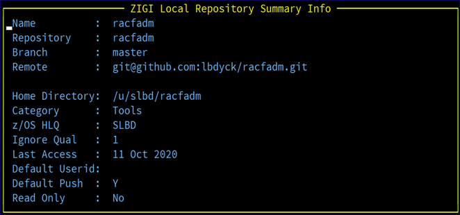

# Info Option

The info option displays a short summary of information about the repository.

*NEXT TOPIC*: [View Option](r_view_option_lrp.md)

**Parent topic:**[Row Selections](r_rr_row_selections_LRP.md)

