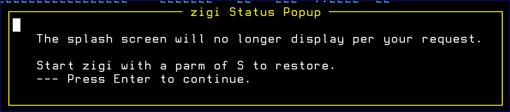

# ISPF Dialog Notes

This topic explains the various ISPF dialog notes you may see while using ZIGI.

Many of the ISPF panels support point-and-shoot for commands as well as row selections. This requires that your TN3270 emulator supports a double-click simulating the ENTER key if using the mouse for point-and-shoot. Alternatively, the cursor may be placed in the field or row, and the ENTER key pressed. Changing the ISPF Settings to enable tab to point-and-shoot also proves useful. The point-and-shoot fields are underscored for easy identification.

The primary table display panels \(Local Repository, Current Repository, PDS Member, and Tag List\) support an ISPF action bar menu. This is in addition to the O command, which displays a pop-up menu of commands.

ISPF pop-ups are used to provide information to you at various points in the dialog where processing may not be instantaneous.

When starting ZIGI, the splash screen always displays. The splash screen can be disabled by entering a Y to the Bypass option on the splash screen. This brings up the **zigi Status Popup**:

*NEXT TOPIC*: [The ZIGI Local Repositories Panel](c_the_zigi_local_repositories_panel.md)

