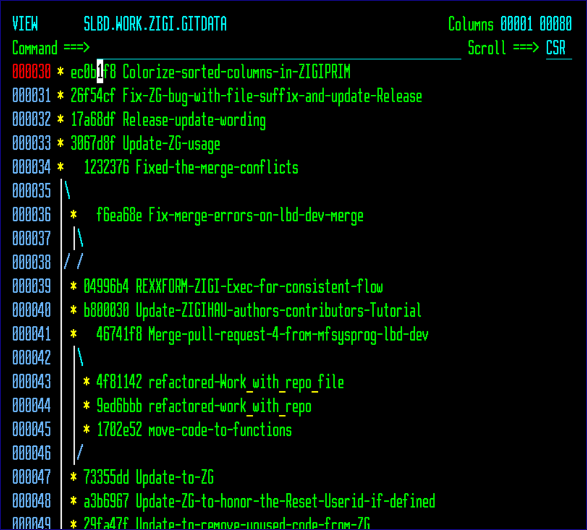

# Network

This topic explains the functionality of the Network command.

Network displays the git log graph report, which can be helpful to see the branch structure of the commit history.

*NEXT TOPIC*: [Options Menu Assist](r_options_menu_assist.md)

**Parent topic:**[The ZIGI Current Repository Panel](c_the_zigi_current_repository_panel.md)

