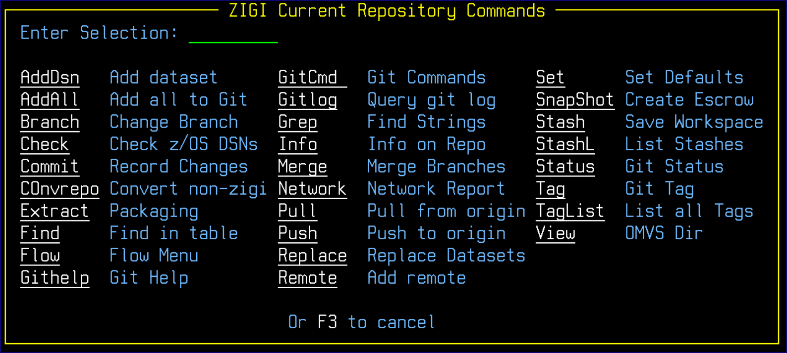

# Options Menu Assist

This topic explains the functionality of the **ZIGI Current Repository Commands** pop-up.

Use O on the command line to bring up a pop-up menu of all available commands. This is useful if you have selected to use the Pro or Hidden menu.

*NEXT TOPIC*: [Pull](r_pull.md)

**Parent topic:**[The ZIGI Current Repository Panel](c_the_zigi_current_repository_panel.md)

