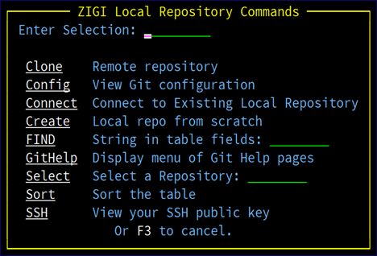

# Options Menu Assist

This topic explains the options menu assist pop-up menu.

Use O on the command line to bring up the **zigi Local Repository Commands** menu of all available commands. This is useful if you selected the Pro or Hidden menu.

*NEXT TOPIC*: [Select Command](r_select_command_lrp.md)

**Parent topic:**[The ZIGI Local Repositories Panel](c_the_zigi_local_repositories_panel.md)

