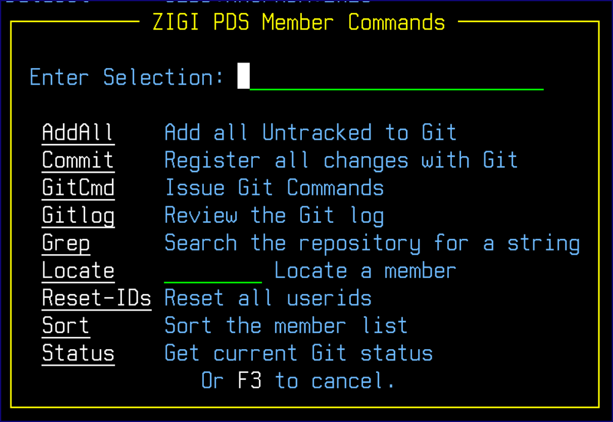

# Options \(O\) Command

The Options \(O\) command displays the **ZIGI PDS Member Commands** menu to assist you if you are using the terse or hidden menu option.

*NEXT TOPIC:* [Member Select Option](r_member_select_option.md)

**Parent topic:**[The ZIGI PDS Member List](c_the_zigi_pds_member_list.md)

