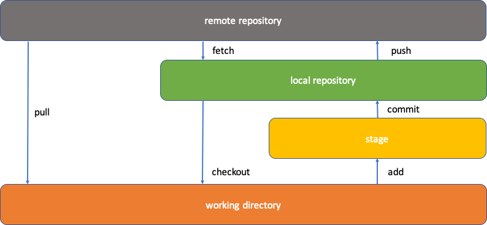

# Pre-Requisites \(Installing Git\)

This topic includes an image that explains the overview of Git processing.

See [Appendix A: Installing Git](r_appendix_a_installing_git.md) for a checklist for installing Git and the additional tools it requires, which are open source and free.

*NEXT TOPIC*: [Installing ZIGI](c_installing_zigi.md)

**Parent topic:**[Overview \(What You Should Know but May Not\)](c_overview.md)

