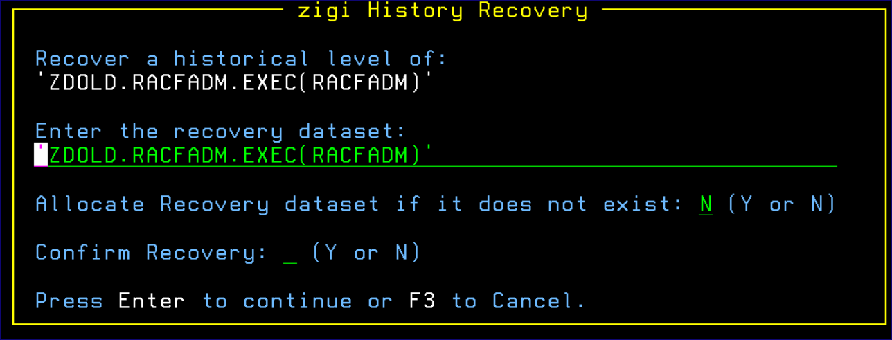

# Recovery

Recovery prompts for a recovery data set if that data set should be allocated new and a confirmation of the recovery. Recovery can occur in the active data set if desired but with an additional confirmation prompt.

*NEXT TOPIC:* [Ignore](r_ignore.md)

**Parent topic:**[History Option](r_history_option.md)

