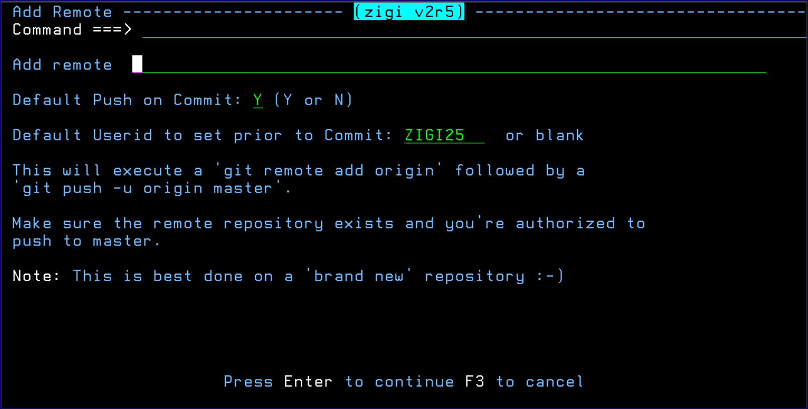

# Remote Command

The Remote command is used for newly created local repositories to be associated with a remote repository.

*NEXT TOPIC*: [Set Command](r_set.md)

**Parent topic:**[The ZIGI Current Repository Panel](c_the_zigi_current_repository_panel.md)

