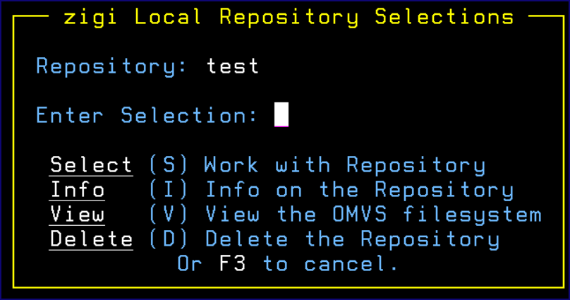

# / Row Selection Prompt

If / is entered for a row selection, the **zigi Local Repository Selections** menu displays to assist you:

*NEXT TOPIC*: [The ZIGI Current Repository Panel](c_the_zigi_current_repository_panel.md)

**Parent topic:**[Row Selections](r_rr_row_selections_LRP.md)

