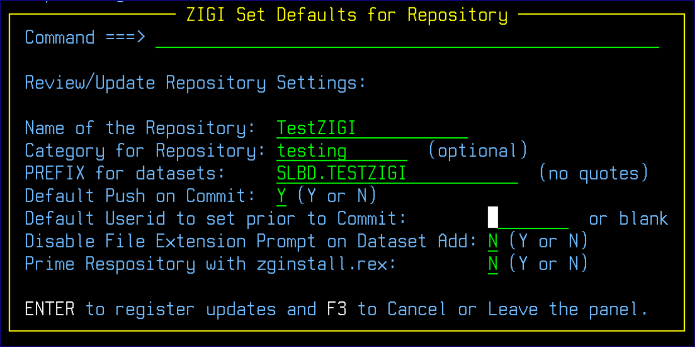

# Set Command

This topic explains the functionality of the Set command.

The Set command is used to define default actions for you.

**Name of the Repository** is the name of the OMVS directory where the repository resides and if changed only results in the name of the repository in the Local Repositories table. The directory is not changed.

**Category for Repository** is an arbitrary description for the repository that allows you to categorize, or group, repositories.

**PREFIX for datasets** is used to define the z/OS data set HLQ that was used when the repository was created or cloned. The Prefix may be changed, and all z/OS data sets are renamed, and depending upon the qualifiers to ignore \(see the INFO display\) it is possible the OMVS files and directories may be renamed as well. To change the Prefix requires that the new prefix have the same number of qualifiers as the original prefix. If OMVS files and/or directories are changed, then git is also updated to be aware of the rename.

**Default Push on Commit** has an option to push after the commit. This setting provides a default, which you may override on the Commit panel at anytime.

The **Default Userid to set prior to Commit** is what all PDS members ISPF Stats are set to when they are processed by Commit. Only those members have their ISPF Stats updated to the specified userid.

**Note:** Do not use 8-character userids unless your system has enabled their use.

The option to **Disable File Extension Prompt on Dataset Add** can be enabled or disabled here.

If the repository is to be distributed to others who may not have ZIGI installed, use the **Prime Repository with zginstall.rex** option to place a zginstall.readme and the zginstall.rex into the repository. See [Appendix B: Using ZGINSTALL.REX](r_appendix_b_using_zginstall_rex.md) for additional information.

*NEXT TOPIC*: [Snapshot](r_snapshot.md)

**Parent topic:**[The ZIGI Current Repository Panel](c_the_zigi_current_repository_panel.md)

