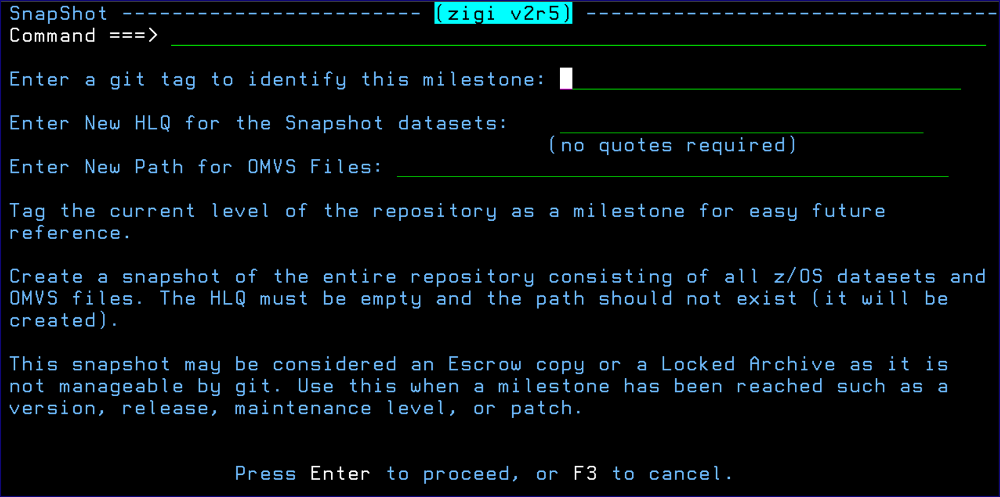

# Snapshot

Snapshot creates an Escrow set of data sets and OMVS files from the current repository outside of Git. This can then be used for packaging and distribution, as well as an archive or backup for auditing and safekeeping purposes.

*NEXT TOPIC*: [Stash](r_stash.md)

**Parent topic:**[The ZIGI Current Repository Panel](c_the_zigi_current_repository_panel.md)

