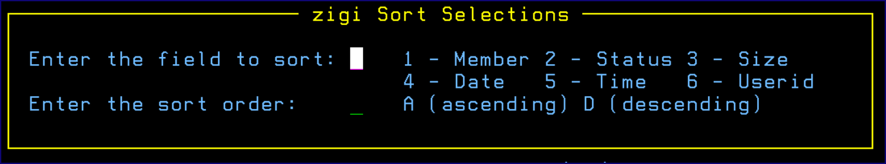

# Sort Command

The Sort command sorts one column in either **A \(ascending\)** or **D \(descending\)** order. When entered without parameters, the **zigi Sort Selections** panel assists you:

The sort syntax is: SORT field order

If the order parameter is blank, then it defaults to **A \(ascending\)**.

The field names may be abbreviated:

|Field|Abbreviation|
|-----|------------|
|MEMBER|ME|
|STATUS|ST|
|SIZE|SI|
|DATE|DA|
|TIME|TI|
|USERID|US|

*NEXT TOPIC:* [Status](r_status_command.md)

**Parent topic:**[The ZIGI PDS Member List](c_the_zigi_pds_member_list.md)

