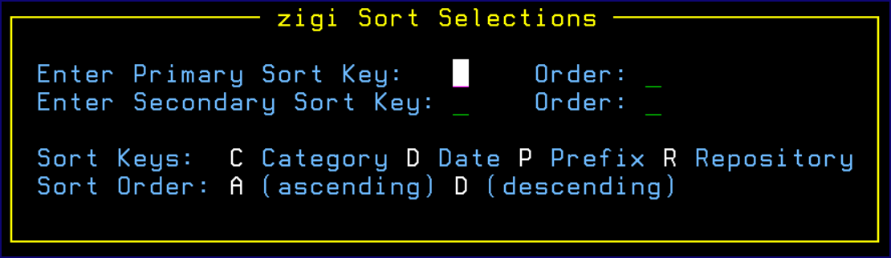

# Sort Selections Pop-Up Menu

This topic explains the **zigi Sort Selections** pop-up menu.

Sort the table based on the columns.

Syntax: Sort column1 order1 column2 order 2

Abbreviation of SO is allowed.

Sort column: **Repository** \(R\), **Prefix** \(P\), **Category** \(C\), or **Date** \(D\)

Sort order: **Ascending** \(A\) or **Descending** \(D\)

If only the command SORT is entered, the **zigi Sort Selections** pop-up displays to assist.

**Note:** The last sort order is retained and used the next time ZIGI starts.

*NEXT TOPIC*: [SSH Public Key](r_ssh_lrp.md)

**Parent topic:**[The ZIGI Local Repositories Panel](c_the_zigi_local_repositories_panel.md)

