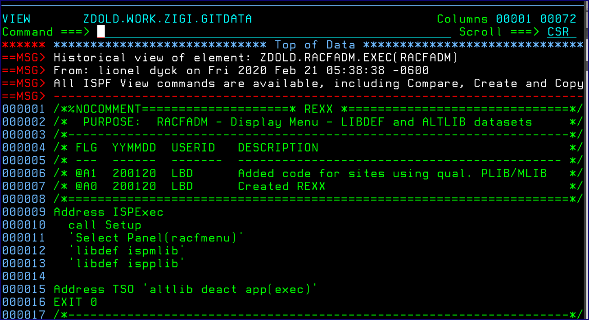

# Source View

This view of the source is from a specific commit. It is placed into a z/OS data set to allow you to use the ISPF Edit Compare, Create, and Copy commands, among other commands.

*NEXT TOPIC:* [Recovery](r_recovery.md)

**Parent topic:**[History Option](r_history_option.md)

