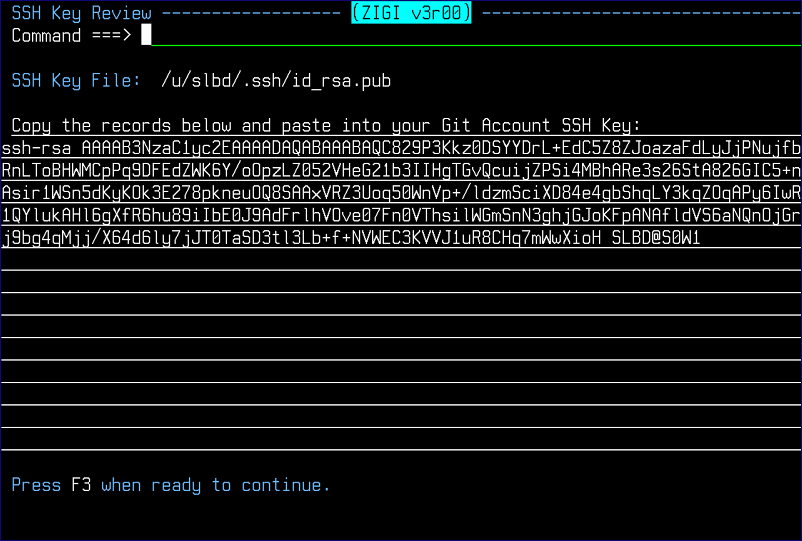

# SSH Public Key

This topic explains how to display your SSH public key.

This command displays your SSH public key so that it can be easily copied and then pasted into your GitHub \(or equivalent\) user profile settings to enable easy access to the remote repository. There is no concern about sharing your public key since it must be used in concert with your private key, which should never be shared with anyone.

*NEXT TOPIC*: [Row Selections](r_rr_row_selections_LRP.md)

**Parent topic:**[The ZIGI Local Repositories Panel](c_the_zigi_local_repositories_panel.md)

