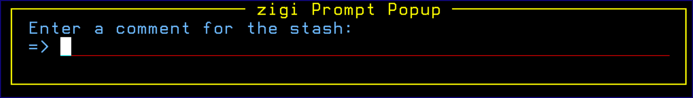

# Stash

Stash saves \(pushes\) your current Git workspace and restores the workspace to the last commit level. This allows you to quickly switch what you’re working on and work on something else without forcing a commit.

**Note:** A stash is never pushed to the remote server. Enter a short description on the **zigi Prompt Popup** screen since you may have multiple stashes in your project.

*NEXT TOPIC*: [Stash List \(STASHL\) Command](r_stash_list.md)

**Parent topic:**[The ZIGI Current Repository Panel](c_the_zigi_current_repository_panel.md)

