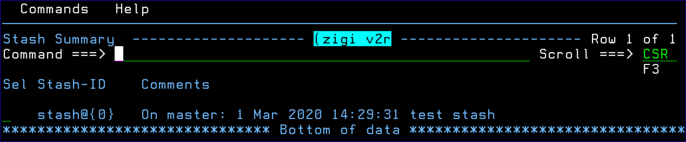
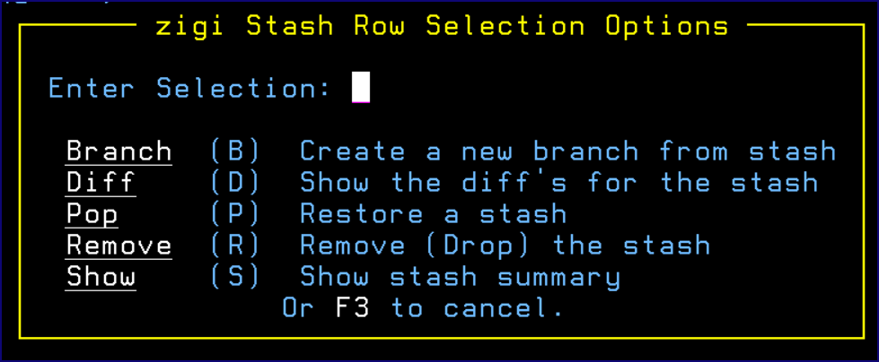

# Stash List \(STASHL\) Command

This topic explains the functionality of the Stash List \(STASHL\) command.

The Stash list \(STASHL\) command lists all stashes in the current repository and provides a number of options.

Available commands with Stash List are currently limited to one at this time. The Clear command removes all stashes in the current repository. Use this only if you are positive you don’t need them anymore. Enter a / in the row selection field to view available line selections:

This section includes the following topics:

-   [Branch](r_branch_CRP.md)
-   [Diff](r_diff.md)
-   [Pop](r_pop.md)
    -   [Pop Conflict Resolution](r_pop_conflict_resolution.md)
-   [Remove](r_remove.md)
-   [Show](r_show.md)

-   **[Branch](r_branch_CRP.md)**  

-   **[Diff](r_diff.md)**  

-   **[Pop](r_pop.md)**  

-   **[Remove](r_remove.md)**  

-   **[Show](r_show.md)**  

**Parent topic:**[The ZIGI Current Repository Panel](c_the_zigi_current_repository_panel.md)

