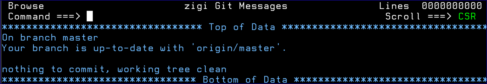

# Status Command

The Status command displays the Git status command results:

*NEXT TOPIC*: [Tag](r_tag.md)

**Parent topic:**[The ZIGI Current Repository Panel](c_the_zigi_current_repository_panel.md)

