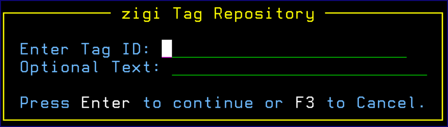

# Tag

Tag adds a Git Tag to the current repository and the tag is pushed to the remote server.

A lightweight tag, one without the optional text, is very much like a branch that doesn’t change — it’s just a pointer to a specific commit. Annotated tags, those with the optional text; however, are stored as full objects in the Git database. They are check summed; contain the tagger name, email, and date; have a tagging message; and can be signed and verified with GNU Privacy Guard \(GPG\). It’s generally recommended that you create annotated tags so you can have all this information; but if you want a temporary tag or for some reason don’t want to keep the other information, lightweight tags are available too.

*NEXT TOPIC*: [TagList](r_taglist.md)

**Parent topic:**[The ZIGI Current Repository Panel](c_the_zigi_current_repository_panel.md)

