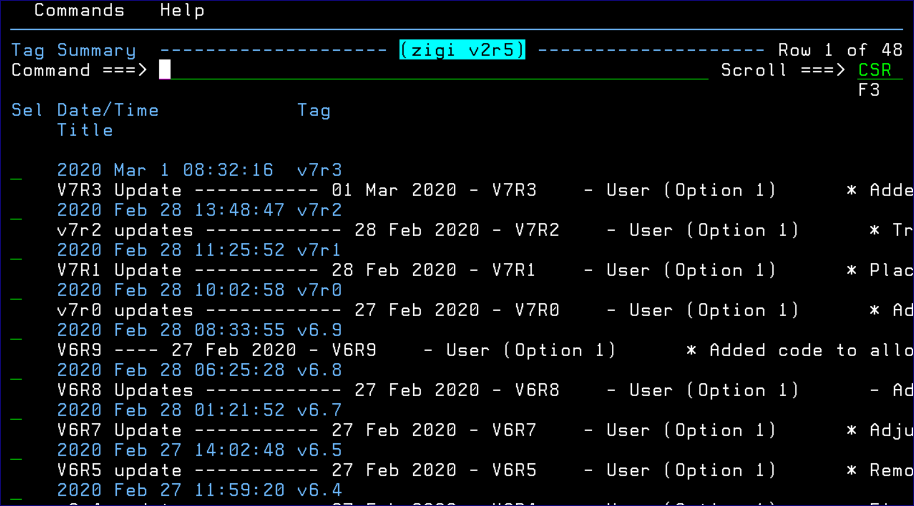
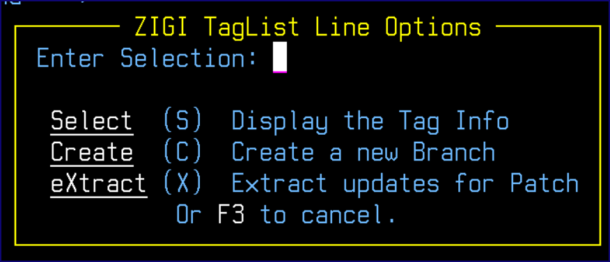
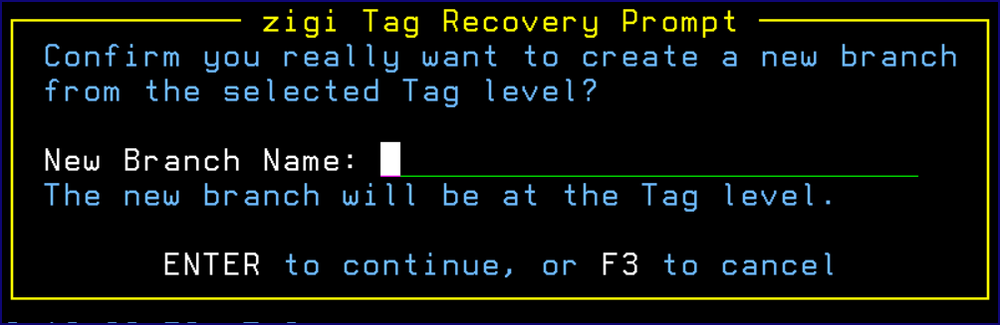

# TagList

This topic explains the functionality of the TagList command.

TagList displays a selection table of all the Tags.

The table may be filtered using the Only command \(for example: only x\) and Refresh recreates the table with all entries. A row selection of S displays the tag details while a selection of C creates a new branch based on the tag level of the repository. This not only changes the OMVS filesystem files to match the tag level file, it also replaces all z/OS data sets to the tag level. Selection X extracts all the changed elements from all the selected tags into a non-Git managed set of z/OS data sets and OMVS directory. This can be used for packaging to distribute only the updated elements \(for example: PTF\). A row selection option of / brings up the **ZIGI TagList Line Options** pop-up:

The **zigi Tag Recovery Prompt** pop-up asks for the name of a new branch for the tag level code:

*NEXT TOPIC*: [View](r_view_CRP.md)

**Parent topic:**[The ZIGI Current Repository Panel](c_the_zigi_current_repository_panel.md)

