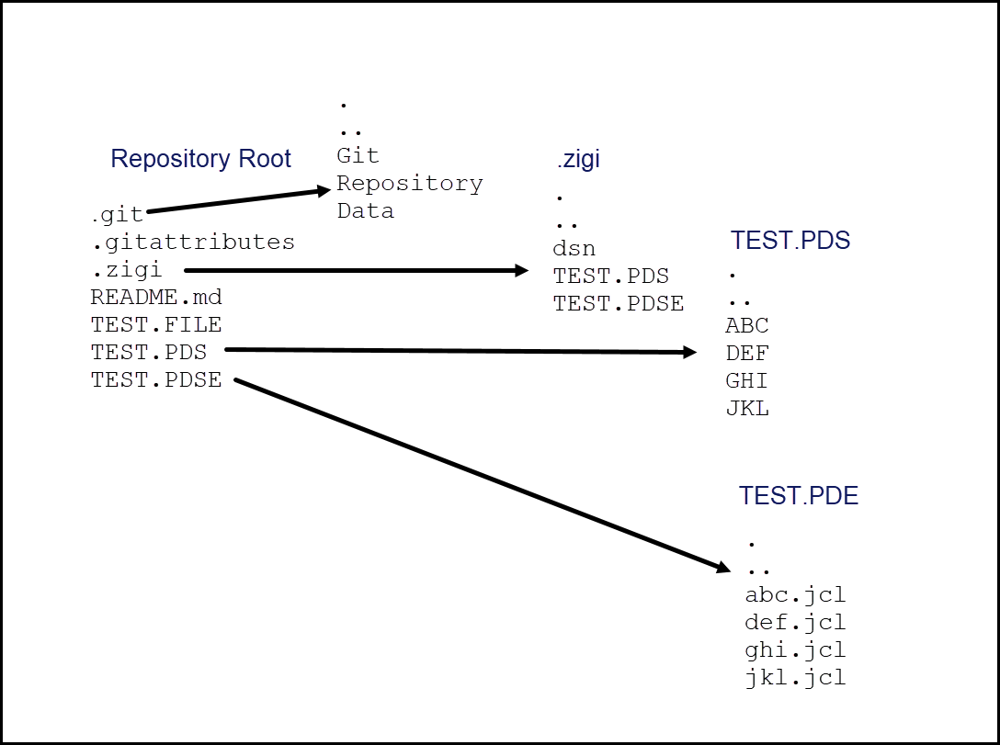

# What is Happening Under the Covers?

When ZIGI opens a repository, the first action is to check the remote server for updates. If there are updates, you are informed that the current branch is behind and needs updating \(pull\). ZIGI also checks all the z/OS data sets and the OMVS filesystem for updates, marking the z/OS data sets if there are modifications in play that need to be added to the index, committed, and pushed. If the data set is a sequential data set, it is always copied to an OMVS file so that Git can detect changes. For a PDS, if the member is new then it is copied to the OMVS directory that maps to the PDS. If a file extension has been defined for the PDS, then the member is copied using the file extension. The extension is defined when the data set is added to ZIGI and stored in the .zigi/dsn file.

This picture provides an example of a ZIGI OMVS filesystem layout.

When a PDS is updated, the ISPF statistics for all members are captured and an OMVS file is updated to accurately reflect the current statistics. This file is then used to compare the members to identify if there are any new or changed members and then flags them. The file is also used during a replace, clone, or pull operation to reset the ISPF statistics as Git has zero awareness of them.

As data sets are added to ZIGI, an OMVS file is updated with the DCB information for that data set. This file is then used during a replace, clone, or pull operation to correctly allocate the z/OS data sets. The space for those data sets is dynamically determined based on the OMVS filesystem usage and are allocated as PDSE version 2 libraries with a zero MAXGEN.

*NEXT TOPIC:* [ZG - ISPF Command](r_zg_ispf_command.md)

