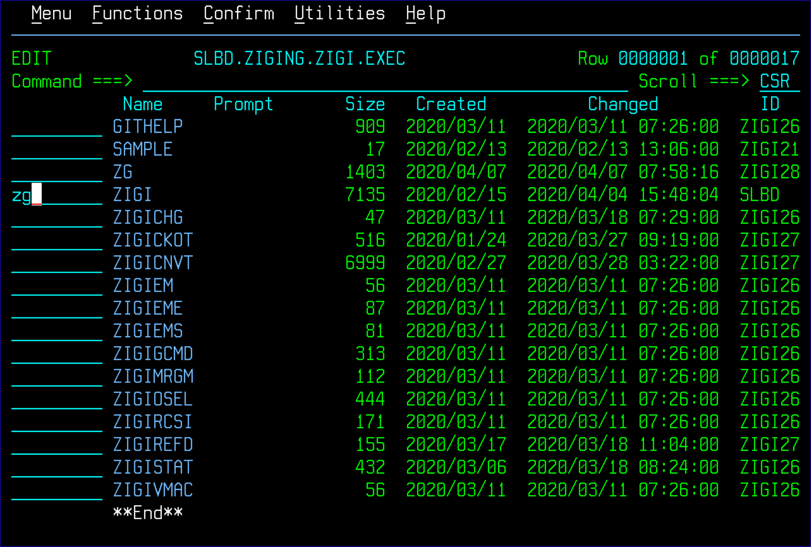
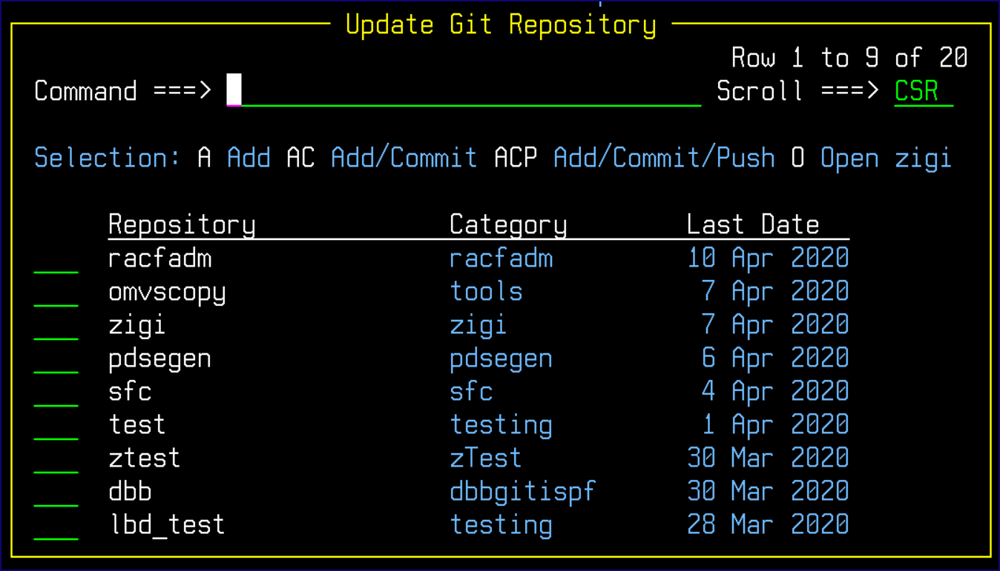
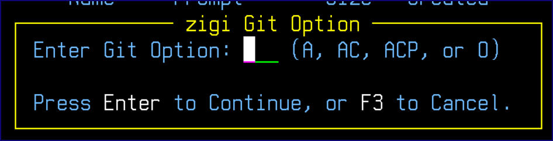

# ZG - ISPF Command

There are times when an element is being edited \(updated\) within a PDS that is part of a ZIGI managed repository. After completing the update, just that element needs to be processed by Git. To edit an element, use the ZG command.

The syntax is: ZG data set\(member\) option

Where: data set\(member\) is the element to be quickly processed by Git.

Options:

|Blank|Prompt for Option|
|-----|-----------------|
|A|Git Add|
|AC|Git Add and Commit|
|ACP|Git Add, Commit, and Push|

For ease of use, zg may be entered on the ISPF member list row command next to the member name to be processed.

If the zg command has not been used before for this data set, then a list of all ZIGI-managed repositories are presented to select from:

If zg has been used with that data set before, then the repository prompt is bypassed, and the **zigi Git Option** pop-up displays:

There is an additional option available via the pop-ups, O, which opens the repository.

*NEXT TOPIC:* [ZGBATCH - Execute ZIGI in Batch](r_zgbatch_execute_zigi_in_batch.md)

