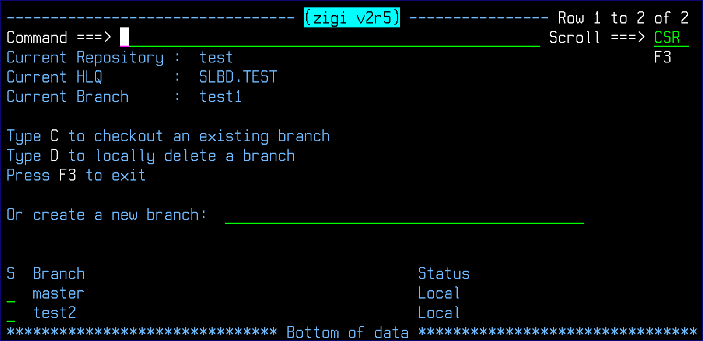

# Changing to a Different Existing, Or New, Branch

Changing to a different branch requires the current branch be clean. Clean means that all changes have been committed. Once the branch is clean, use the Branch command and either select an existing branch using C \(for checkout\) or enter the name of a new branch.

When changing to an existing branch:

1.  Git updates the Git index and all the files in the workspace to the state in the selected branch.
2.  ZIGI then replaces all the existing z/OS data sets with the OMVS files that correspond to the branch.

When changing to a new branch:

1.  Git creates a new Git index for the new branch with the state of the current files.
2.  ZIGI updates its status to use the new branch.

*NEXT TOPIC:* [What is Happening Under the Covers?](r_what_is_happening_under_the_covers.md)

**Parent topic:**[Typical ZIGI Activities](c_typical_zigi_activities.md)

