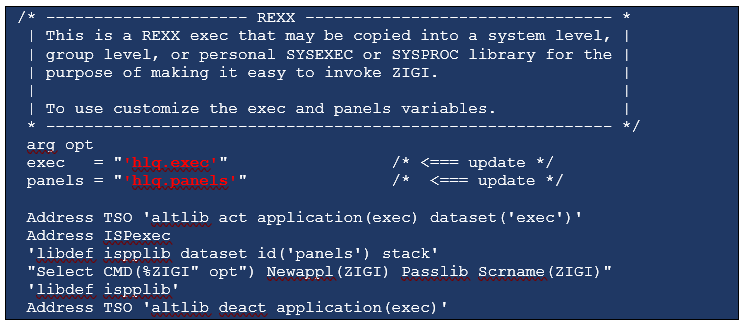

# Starting ZIGI the First Time

This task explains how to start ZIGI for the first time.

1.  In ISPF, use option 3.4 and enter the HLQ provided during the installation process or enter DSLIST hlq on the ISPF command line.

2.  Select the EXEC data set using Browse, Edit, or View.

    **Note:** ZIGI saves its repository ISPF table in the data set referenced by ISPTABL, but if that DD is not used then it uses the DD ISPPROF as the location for the table.

3.  Next to the ZIGI member, enter EX to execute it.

    This exec is the main ZIGI code and dynamically allocates the EXEC library using ALTLIB and the PANELS library using LIBDEF.

    

4.  A more permanent option is to edit this sample REXX code, make the necessary customizations, and place it in a library in your SYSEXEC concatenation and invoke from any ISPF panel using the command TSO %ZIGI. This sample can be found in the provided EXEC library under the name SAMPLE.

    

    The ZIGI Splash panel is presented.

    

5.  Next, you are prompted for your username and e-mail along with three ZIGI processing defaults:

    1.  It is recommended that the **PDSE Member Generations** default value is 0 unless you have a tool that supports working with member generations. See [PDSEGEN on file 969](http://www.cbttape.org).
    2.  The **Display Options Popup** option changes the behavior of point-and-shoot so that on table panels, a click above the table displays the commands pop-up and anywhere in the table the line selection pop-up options.
    3.  Set the **Bypass File Extension Prompt** if you do not plan to use file extensions for the OMVS files.
    

6.  After providing your name and e-mail, if you haven’t created an SSH key pair yet, ZIGI creates this for you and shows you the public part of the keypair that you can add to your profile on GitHub \(or BitBucket, GitLab, or your private enterprise Git server\).

    

7.  Copy your SSH key and paste it into one of the following:

    -   GitHub settings

        1.  Click on your icon, and then click **Settings**.
        2.  Click **SSH and GPG keys**.
        3.  Click **New SSH key**, enter a description, and then paste your SSH key.
        

    -   BitBucket settings

        1.  Click on your icon.
        2.  Click **Bitbucket settings**.
        3.  Click **SSH keys**.
        4.  Click **Add key**, enter a title, and then paste your SSH key where directed.
        

    -   GitLab settings

        1.  Click the User Settings icon in the upper right-hand corner.
        2.  From the drop-down menu, select **Settings**.
        3.  Click **SSH Keys**.
        4.  Paste your key, enter a title, and then click **Add key**.
        

        *NEXT TOPIC*: [ISPF Dialog Notes](r_ispf_dialog_notes.md)

